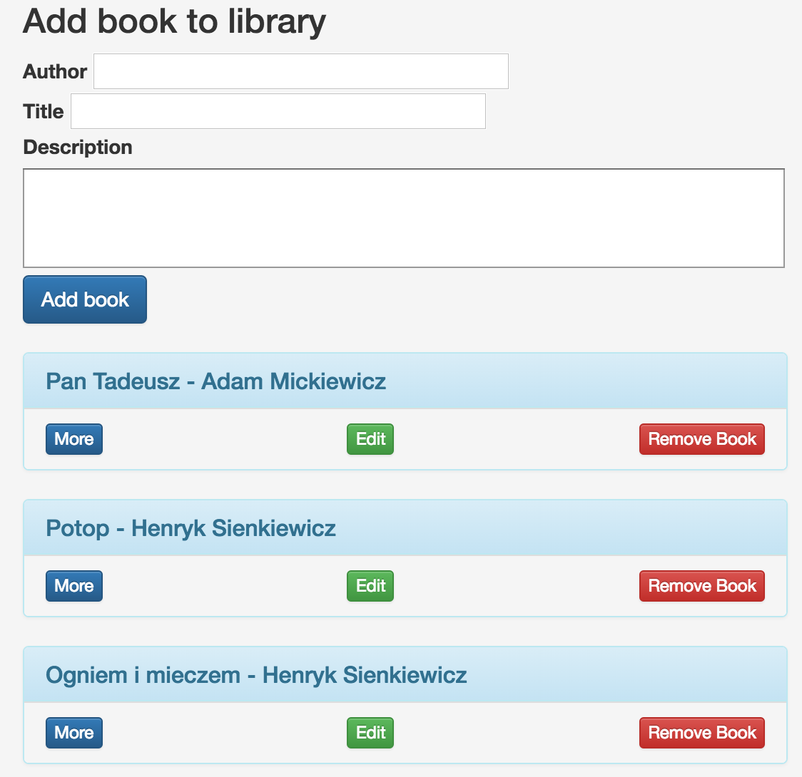
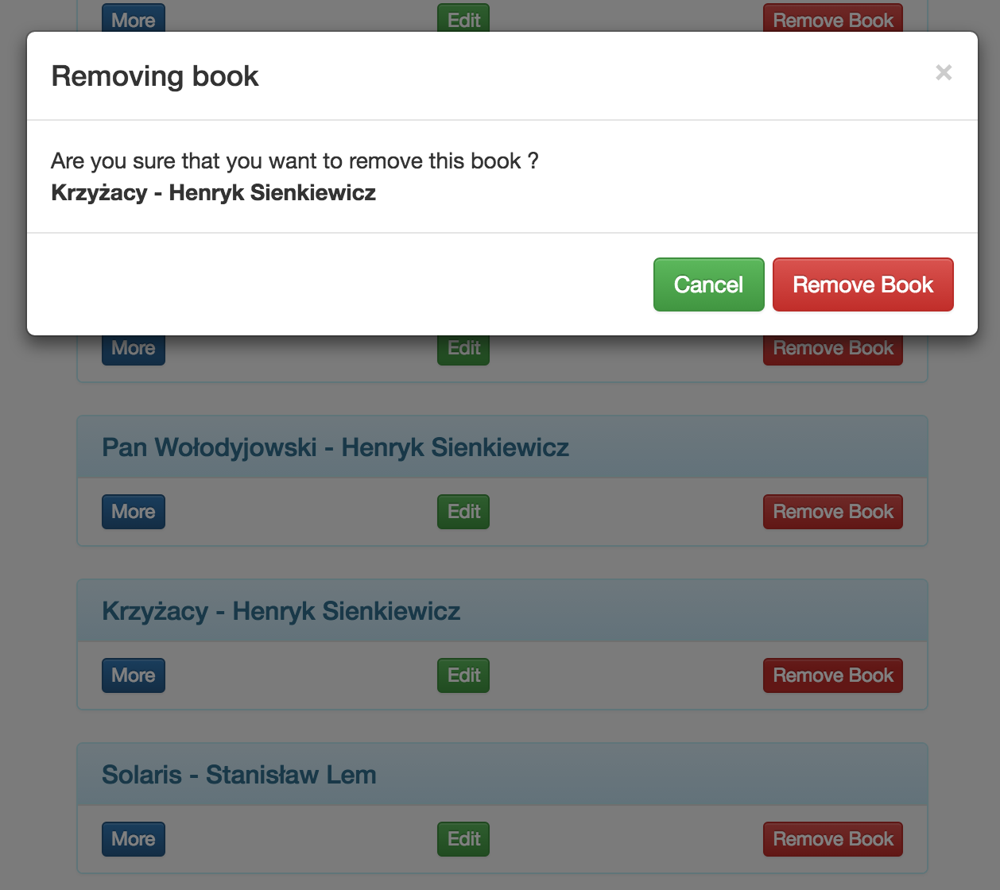

## **REST-API** exercise at <a target="_blank" href="http://coderslab.pl">CodersLab</a> **BACK-END Developer** training

working example at [Book Library](http://geomysiar.pl/books/)

### Components used
 * [Bootstrap] (http://getbootstrap.com)
 * [Bootstrap SB Admin Template](https://startbootstrap.com/template-overviews/sb-admin/)
 * [Bootstrap modals made easy] (http://bootboxjs.com)
 * [Mustache] (http://mustache.github.io)

### Requirements
 * obtain mustache by: ***composer update*** or ***composer install***

